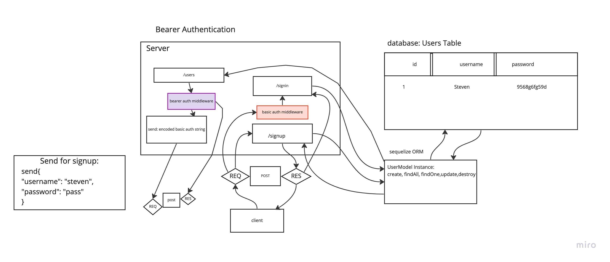

# LAB - Class 07

## Project:  Bearer Authentication

### Author: Steven Rejdukowski

### Problem Domain

In this phase, the new requirement is that any user that has successfully logged in using basic authentication (username and password) is able to continuously authenticate … using a “token”

### Links and Resources

- [ci/cd](https://github.com/Stevenrej/auth-server/actions) (GitHub Actions)
- [prod deployment](https://bearer-auth.onrender.com/)

### Setup

#### `.env` requirements (where applicable)

see `.env.sample`

PORT=3000
DATABASE_URL=postgres://localhost:5432/basic-auth
SECRET=thisIsMySecret

#### How to initialize/run your application (where applicable)

- nodemon

#### Features / Routes

- Feature One: User Database
- POST : `/signin`
- POST : `/signup`
- GET : `/users`
- GEt: `/secret`

#### Tests

basic auth middleware
bearer auth middleware
get secret
get users
sign in
sign up
router

#### UML

